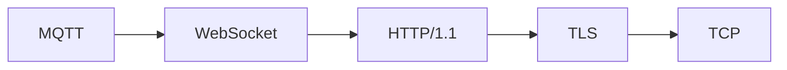
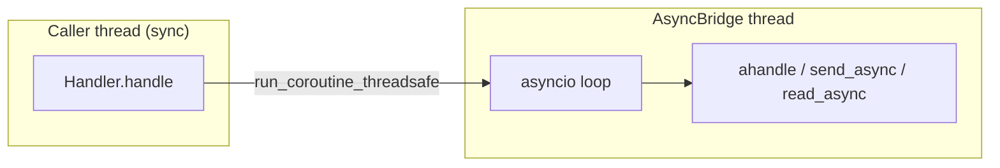

# my-lan-prober

> Probe a LAN, identify the services behind every open port, and enrich the
> router's DHCP lease table — from one declarative, async-first toolkit.

`my-lan-prober` discovers live hosts, identifies the services behind each open
port, and correlates everything with your router's DHCP lease table. It treats
every protocol as a **layer in a session stack** (`TCP → TLS → HTTP/1.1`) and
every scan as a **chain of handlers** that dispatch on what the wire reveals.

It grew out of a tested single-file script (`tplogin-minimal.py`); the
service-identification rules are a faithful, behaviour-identical port of that
script, now behind testable seams.

[](https://www.gnu.org/licenses/agpl-3.0)
[](https://www.python.org/downloads/)
[](https://github.com/astral-sh/uv)

---

## Table of Contents

- [Why](#why)
- [Features](#features)
- [Architecture](#architecture)
  - [Layered session stacks](#layered-session-stacks)
  - [Handler chain](#handler-chain)
  - [Persistors](#persistors)
  - [Async-first, sync-friendly](#async-first-sync-friendly)
- [Installation](#installation)
- [Quick start](#quick-start)
- [CLI reference](#cli-reference)
- [Environment variables](#environment-variables)
- [Extending my-lan-prober](#extending-my-lan-prober)
- [Output](#output)
- [Design notes](#design-notes)
- [Development](#development)
- [License](#license)

---

## Why

Typical LAN recon means juggling `nmap`, `arp -a`, a browser session on the
router, a pile of ad-hoc `socket.connect()` calls, and some regexes to guess
what's listening. `my-lan-prober` folds all of that into one pipeline with
first-class abstractions for the things you keep re-implementing:

- **Protocols as data.** 79 protocols are described in a single `LAYERS`
  table; a protocol layer is a framing strategy plus optional
  encrypt/decrypt transforms and an optional handshake payload.
- **Parsed packets, not raw bytes.** Handlers own the payload gluing and
  persist structured rows.
- **Every knob configurable.** CLI flag > env var > default; nothing is
  hard-coded.
- **Chain-of-responsibility by construction.** `<<` and `>>` compose handlers
  into pipelines; `+=` dispatches on banner matches.
- **Optional dependencies, lazily imported.** `playwright`, `asyncssh`, and
  `python-dotenv` are imported only when the feature that needs them is used.

## Features

- 🔍 **Port probing** across 17 common LAN ports, with a configurable TCP
  connect timeout.
- 🧩 **Layered protocol detection** — 79 layers described as data: TCP, UDP,
  TLS, SSH, HTTP/1.1, HTTP/2, HTTP/3, QUIC, WebSocket, gRPC, MQTT, AMQP,
  Kafka, DNS, mDNS, NFS, SMB, RDP, VNC, LDAP, SMTP/IMAP/POP3, SIP, RTP, CoAP,
  and more.
- 🏠 **DHCP lease scraping** with automatic source fallback: TP-Link
  (`tplogin.cn`) → local ARP table → OpenWRT over SSH.
- 🖥️ **OS-independent local ARP fallback** — tries `/proc/net/arp`, then
  `ip neigh`, then `arp -an`/`arp -a`, so it works on Linux, macOS, BSD, and
  Windows with no extra dependency. This is what you get when `tplogin.cn`
  does *not* point at a TP-Link router.
- 🎭 **Playwright fetcher** for routers with a web UI, replicating the tested
  login flow.
- 💾 **Pluggable persistence** — Pickle, JSONL, SQLite, Arrow/Parquet; or
  in-memory if you skip it entirely.
- 🧵 **One asyncio loop per process**, safely bridged to a sync API — no
  greenlets, no "sync API inside asyncio" errors.
- 🧪 **Everything testable** — 267 tests; handlers, sessions, and fetchers are
  independent and can be driven by hand.

## Architecture

### Layered session stacks

Every protocol is a **decorator over the one below it**. You describe a stack
by name and the factory builds it:



```python
SessionFactory.build(["TCP", "TLS", "HTTP/1.1", "WebSocket", "MQTT"])
```

A layer is a single `LayerSpec` entry:

```python
"TLS": LayerSpec(
    "TLS",
    LengthPrefixFraming(2, header_bytes=5, prefix_offset=3),
    allowed_bases=("TCP",),
    ports_hint=(443, 465, 636, 853, 993, 995),
    description="TLS / SSL over TCP",
),
```

> **Note on TLS framing.** A TLS record header is
> `type(1) version(2) length(2)` — the length field sits at offset 3, not 0.
> `design.md` § 1c writes this as `LengthPrefixFraming(2, header_bytes=5)`,
> which would read the length from offset 0 (that is `0x16 0x03`, i.e. 5635,
> for a handshake record). The implementation adds an explicit
> `prefix_offset` and the difference is covered by a test.

`TableSession` is the single concrete class that turns a `LayerSpec` into
behaviour:

| Field | Meaning |
|---|---|
| `framing` | how this layer slices a byte stream into messages |
| `transform_out` / `transform_in` | byte-level encrypt/decrypt |
| `handshake_out` | bytes to send once on open (`ClientHello`, `EHLO`, …) |
| `override_class` | escape hatch — use a hand-written class instead |
| `allowed_bases` | documentation; the real check is the stack you build |
| `ports_hint` | suggested ports |
| `requires` | auth shims this layer typically sits above |

### Handler chain

Handlers compose with `<<` and `>>`; dispatch-on-banner uses `+=`:

```python
from my_lan_prober import RegexBannerHandler, SessionFactory, SocketBannerHandler

session = SessionFactory.build(["TCP"], host="192.168.1.104", port=8000)

scanner = SocketBannerHandler(stack=["TCP"], session=session)
scanner += RegexBannerHandler(r"^SSH-", name="SSH", stack=["TCP", "SSH"])
scanner += RegexBannerHandler(r"TornadoServer", name="JupyterHub")

result = scanner.handle("192.168.1.104", port=8000)
print(result.service, result.banner[:60])
```

Rules:

- `a << b` → chain in order; `a >> b` → reversed; chaining is associative.
- `socket_handler += child` smoke-tests `child.check_banner(b"")` and rejects
  the child if it raises.
- When a child declares a deeper `REQUIRED_STACK`, the parent **upgrades the
  live session in place** — reusing the already-open TCP socket.

### Persistors

Persistence is optional. When present, it stores **parsed packets**, not raw
frames. `store_full` chains `store` calls through `previous_id` so a
multi-field packet comes back as one linked row:

```python
class Persistor(ABC):
    def history(self) -> pd.DataFrame: ...
    def register(self, column_name: str) -> None: ...
    def store(self, column: str, data, previous_id=None) -> str: ...
    def store_full(self, data: dict) -> str: ...   # default impl over store()
    def retrieve(self, id, location=None) -> dict | None: ...
    def persist(self, path) -> None: ...
    def resume(self, path) -> None: ...
```

Built-in backends: `PicklePersistor`, `JSONLPersistor`, `SQLitePersistor`,
`ArrowPlasmaPersistor`. No persistor → in-memory only.

### Async-first, sync-friendly

All I/O is `async`. A single **`AsyncBridge`** runs one `asyncio` loop in a
background thread; sync callers (`Handler.handle`, `Session.send`) block on
`run_coroutine_threadsafe`. This is how the toolkit avoids Playwright's
"sync API inside asyncio loop" trap:



## Installation

`my-lan-prober` uses [`uv`](https://github.com/astral-sh/uv):

```bash
# Clone
git clone https://github.com/<you>/my-lan-prober.git
cd my-lan-prober

# Create venv and install with dev extras
uv sync --extra dev

# Optional runtime extras
uv sync --extra playwright --extra ssh --extra dotenv
```

Or, as a dependency:

```bash
uv add my-lan-prober[playwright,ssh,dotenv]
```

Only `pandas` and `tqdm` are mandatory. Everything else is optional and
imported lazily.

## Quick start

```bash
# Scan the LAN and enrich the router's DHCP lease table
uv run my-lan-prober

# Custom port timeout and output path
uv run my-lan-prober --port-timeout 0.2 --output data/leases.csv

# Skip the router entirely: use the local OS ARP table
uv run my-lan-prober --fetcher unix

# Non-interactive TP-Link login (warns: argv leaks to ps / shell history)
uv run my-lan-prober --unsafe-tplogin-password 'hunter2'
```

As a library:

```python
from my_lan_prober import Config, Engine

config = Config.resolve(["--fetcher", "unix", "--output", "data/leases.csv"])
frame = Engine(config).run()
print(frame[["host", "ip_address", "detected_services"]])
```

## CLI reference

| Flag | Env | Default | Description |
|---|---|---|---|
| `-t, --port-timeout SECONDS` | `PORT_TIMEOUT` | `0.1` | TCP connect timeout |
| `--workers N` | `SCAN_WORKERS` | `os.cpu_count()` | Parallel worker threads |
| `--resolve-host HOST` (repeatable) | `RESOLVE_HOSTS` (csv) | `tplogin.cn,localhost` | Hostnames to resolve & probe |
| `--output PATH` | `OUTPUT_CSV` | `data/tplogin-arp-enriched.csv` | Unified output CSV |
| `--fetcher {tplogin,unix,windows,openwrt,auto}` | `ARP_FETCHER` | `tplogin` | Preferred ARP source |
| `--unsafe-tplogin-password PW` | `TPLOGIN_PASSWORD` | prompt | ⚠️ Non-interactive login — leaks to `ps` |
| `--browser NAME` | `PW_BROWSER` | `chromium` | Playwright browser engine |

**Precedence:** CLI flag > environment variable > default.

## Environment variables

Every CLI flag has an env-var equivalent (see table above). Additional:

| Variable | Purpose |
|---|---|
| `TPLOGIN_PASSWORD` | Router admin password (safer than `--unsafe-tplogin-password`) |
| `PROBESTACK_LOG_LEVEL` | `DEBUG` / `INFO` / `WARNING` (default `INFO`) |
| `OPENWRT_HOST` | Host for the OpenWRT SSH fetcher |

## Extending my-lan-prober

### Add a protocol layer

Drop one entry into the `LAYERS` table:

```python
from my_lan_prober.framing import DelimiterFraming
from my_lan_prober.layers import LAYERS, LayerSpec

LAYERS["MyProto"] = LayerSpec(
    "MyProto",
    DelimiterFraming(b"\x00"),
    allowed_bases=("TCP", "TLS"),
    ports_hint=(1234,),
    description="My custom protocol",
)
```

Then build a stack with `SessionFactory.build(["TCP", "TLS", "MyProto"])`.

Need real code? Set `override_class` to a `Session` subclass.

### Add a handler

```python
from my_lan_prober import ScanResult, SocketBannerHandler


class MyProtoBannerHandler(SocketBannerHandler):
    REQUIRED_STACK = ["TCP", "TLS", "MyProto"]

    def load_full(self, payload):
        return my_proto_parse(payload)          # → dict | None

    def handle_banner(self, banner, port=None):
        return ScanResult(port=port, service="MyProto", banner=banner)
```

### Add a persistor

```python
from my_lan_prober import Persistor


class DuckDBPersistor(Persistor):
    def store(self, column, data, previous_id=None) -> str:
        ...                                     # return a unique record id
    def history(self): ...
    def persist(self, path=None): ...
    def resume(self, path=None): ...
```

### Add an ARP source

```python
from my_lan_prober import ARPTableFetcher


class FritzBoxFetcher(ARPTableFetcher):
    def iptable(self):
        # Return a DataFrame with at least ["ip", "mac_address", "mode"]
        ...
```

Compose a fallback chain with `>>`:

```python
fetcher = TPLoginFetcher() >> UnixArpFetcher() >> OpenWRTFetcher()
```

## Output

One unified CSV — `data/tplogin-arp-enriched.csv` by default:

| Column | Meaning |
|---|---|
| `host` | Lease hostname reported by the router |
| `mac_address` | Lease MAC address |
| `ip_address` | Lease IPv4 address |
| `valid_time` | Remaining lease time |
| `mode` | `dhcp` / `arp` / `static` / `dynamic` |
| `icmp_ping` | ICMP reachability |
| `detected_services` | Semicolon-joined `port:service` list |
| `port_<N>_service` | Service identified on port `N` |
| `port_<N>_banner` | Truncated banner / first response bytes |

A per-host `data/<host>/ssh.sh` helper is written for every host with an open
SSH port. It forwards every other detected service, so a JupyterHub found on
`:8000` becomes reachable at `http://localhost:8000`:

```bash
#!/usr/bin/env bash
ssh \
    -p 22 \
    -o ServerAliveInterval=30 \
    -o ServerAliveCountMax=3 \
    -o ExitOnForwardFailure=yes \
    -L 8000:localhost:8000 \
    192.168.1.104
```

## Design notes

- **`Session` is transport-only.** `send` / `read` move bytes; the persistor is
  invoked by the handler's `_on_io` hook after each I/O op.
- **Persistence sits at the top of the stack.** Lower layers keep
  `_persistor=None`; only the last layer stores parsed packets.
- **`SocketBannerHandler` takes both a stack spec and a live session.** When a
  child needs a deeper stack, the handler upgrades **in place**, reusing the
  live socket's file descriptor.
- **`Framing` strategies** carry the shape of every protocol: stream,
  datagram, length-prefix, varint, delimiter, fixed-size, request-response,
  multiplex. 79 protocols collapse to 8 framing strategies plus a data table.
- **Local ARP is the fallback, not the default.** If `tplogin.cn` doesn't
  resolve to a TP-Link router, the chain falls through to the OS ARP table,
  which needs no credentials and no extra dependency.

## Development

```bash
uv sync --extra dev
uv run ruff format .
uv run ruff check .
uv run pytest -q
```

Tests are written test-first: each module's history has a `[WIP][RED]` commit
that adds failing tests, followed by a `[GREEN]` commit that makes them pass.

## License

`my-lan-prober` is licensed under the **GNU Affero General Public License v3.0
or later**. See [`LICENSE`](LICENSE) for the full text.

> Because this is a network-facing tool, the AGPL's Section 13 (network
> interaction) applies: if you run a modified version as a service, you must
> offer the corresponding source to your users.
