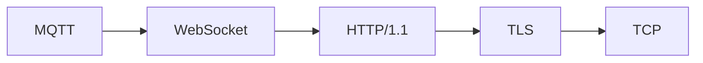

# ProbeStack

> Probe a LAN, walk the protocol stack, harvest the DHCP leases, and enrich
> every host with parsed service banners — all from one declarative,
> async-first Python toolkit.

ProbeStack discovers live hosts, identifies the services behind each open
port, and correlates everything with your router's DHCP lease table. It
does this by treating every protocol as a **layer in a session stack**
(`TCP → TLS → HTTP/1.1 → gRPC`, `UDP → QUIC → HTTP/3 → DNS`, …) and every
scan as a **chain of handlers** that dispatch on what the wire reveals.

It is built to be *extended*: add a protocol, add a persistence backend, add
a handler, or plug in a new ARP source — all without touching the core.

[](https://www.gnu.org/licenses/agpl-3.0)
[](https://www.python.org/downloads/)
[](https://github.com/astral-sh/uv)

---

## Table of Contents

- [Why](#why)
- [Features](#features)
- [Architecture](#architecture)
  - [Layered session stacks](#layered-session-stacks)
  - [Handler chain](#handler-chain)
  - [Persistors](#persistors)
  - [Async-first, sync-friendly](#async-first-sync-friendly)
- [Installation](#installation)
- [Quick start](#quick-start)
- [CLI reference](#cli-reference)
- [Environment variables](#environment-variables)
- [Extending ProbeStack](#extending-probestack)
  - [Add a protocol layer](#add-a-protocol-layer)
  - [Add a handler](#add-a-handler)
  - [Add a persistor](#add-a-persistor)
  - [Add an ARP source](#add-an-arp-source)
- [Output](#output)
- [Design notes](#design-notes)
- [Contributing](#contributing)
- [License](#license)

---

## Why

Typical LAN recon means juggling `nmap`, `arp -a`, a browser session on the
router, a pile of ad-hoc `socket.connect()` calls, and some regexes to
guess what's listening. ProbeStack folds all of that into one pipeline with
**first-class abstractions** for the things you keep re-implementing:

- **Protocols as data.** ~70 protocols are described in a single
  `LAYERS` table; a protocol layer is a framing strategy + optional
  encrypt/decrypt transforms + optional handshake bytes.
- **Parsed packets, not raw bytes.** Handlers own the payload gluing and
  persist structured rows — not a wall of `b"...\r\n\r\n..."`.
- **Every knob configurable.** CLI flag > env var > default; nothing is
  hard-coded.
- **Chain-of-responsibility by construction.** `<<` and `>>` compose
  handlers into pipelines; `+=` dispatches on banner matches.
- **Optional dependencies, lazy-loaded.** `asyncssh`, `asyncvnc`,
  `openai`, `playwright`, `zeroconf`, `pyarrow` are imported only when the
  layer that needs them is instantiated.

## Features

- 🔍 **Parallel port scanning** — bounded by `--workers` (defaults to
  `os.cpu_count()`).
- 🧩 **Layered protocol detection** — TCP, UDP, TLS, SSH, HTTP/1.1, HTTP/2,
  HTTP/3, QUIC, WebSocket, gRPC, MQTT, AMQP, Kafka, DNS, mDNS, NFS, SMB,
  RDP, VNC, LDAP, SMTP/IMAP/POP3, SIP, RTP, CoAP, and more.
- 🏠 **DHCP lease scraping** with automatic source fallback:
  TP-Link (`tplogin.cn`) → Unix/Windows ARP table → OpenWRT over SSH.
- 🎭 **Playwright fetcher** with persistent user-data dir, browser auto-
  detection, and a `run(context, password)` hook you fill in from
  `playwright codegen`.
- 💾 **Pluggable persistence** — Pickle, JSONL, SQLite, Arrow/Plasma; or
  in-memory if you skip it entirely.
- 🧵 **One asyncio loop per process**, safely bridged to a sync API — no
  greenlets, no "sync API inside asyncio" errors.
- 🧪 **Everything testable** — handlers, sessions, persistors are
  independent; you can drive any of them by hand.

## Architecture

### Layered session stacks

Every protocol is a **decorator over the one below it**. You describe a
stack by name and ProbeStack builds it:



```python
SessionFactory.build(["TCP", "TLS", "HTTP/1.1", "WebSocket", "MQTT"])
```

The stack spec mirrors real protocol dependencies:

| Application | Stack |
|---|---|
| HTTPS | `["TCP", "TLS", "HTTP/1.1"]` |
| HTTP/3 | `["UDP", "QUIC", "HTTP/3"]` |
| gRPC | `["TCP", "TLS", "HTTP/2", "gRPC"]` |
| DoH | `["TCP", "TLS", "HTTP/2", "DNS"]` |
| SFTP | `["TCP", "SSH", "SFTP"]` |
| NFS | `["TCP", "ONC RPC", "NFS"]` |
| MQTT over WSS | `["TCP", "TLS", "HTTP/1.1", "WebSocket", "MQTT"]` |
| WebRTC media | `["UDP", "DTLS", "SRTP", "WebRTC"]` |
| CoAP over DTLS | `["UDP", "DTLS", "CoAP"]` |

A layer is a single `LayerSpec` entry:

```python
"TLS": LayerSpec(
    name="TLS",
    framing=LengthPrefixFraming(2, header_bytes=5),
    transform_out=tls_encrypt,
    transform_in=tls_decrypt,
    allowed_bases=("TCP",),
    ports_hint=(443, 465, 636, 853, 993, 995),
    description="TLS / SSL over TCP",
),
```

If a protocol needs real code (a library, an async state machine), you set
`override_class` and ship one small class; everything else is data.

### Handler chain

Handlers are composed with `<<` and `>>`; dispatch-on-banner uses `+=`:

```python
scanner = SocketBannerHandler(
    stack=["TCP"],
    session=AsyncSocketSession(sock),
    persistor=JSONLPersistor("scan.jsonl"),
)

scanner += RegexBannerHandler(r"^SSH-",        name="SSH",     stack=["TCP", "SSH"])
scanner += RegexBannerHandler(r"^@RSYNCD",     name="RSYNC",   stack=["TCP", "RSYNC"])
scanner += RegexBannerHandler(r"TornadoServer", name="Jupyter", stack=["TCP", "TLS", "HTTP/1.1"])

root = ssh_scanner << http_scanner << generic_scanner
```

Rules:

- `a << b` → `[a, b]`; `a >> b` → `[b, a]`; chaining is associative.
- `socket_handler += child` smoke-tests `child.check_banner(b"")` and
  rejects the child if it raises.
- When a child declares a deeper `REQUIRED_STACK`, the parent **upgrades
  the live session in place** — reusing the already-open TCP socket.

### Persistors

Persistence is optional. When present, it stores **parsed packets**, not
raw frames:

```python
class Persistor(ABC):
    def history(self) -> pd.DataFrame: ...
    def register(self, column_name: str) -> None: ...
    def store(self, column: str, data, previous_id=None) -> int: ...
    def store_full(self, data: dict) -> int: ...     # default impl over store()
    def retrieve(self, id, location=None) -> dict | None: ...
    def persist(self, path) -> None: ...
    def resume(self, path) -> None: ...
```

Built-in backends: `PicklePersistor`, `JSONLPersistor`, `SQLitePersistor`,
`ArrowPlasmaPersistor`. No persistor → in-memory only.

### Async-first, sync-friendly

All I/O is `async`. A single **`AsyncBridge`** runs one `asyncio` loop in a
background thread; sync callers (`Handler.handle`, `Session.send`) block on
`run_coroutine_threadsafe`. This is how ProbeStack avoids Playwright's
"sync API inside asyncio loop" trap and keeps the handler chain
protocol-agnostic:


Mixed sync/async handlers compose seamlessly — every `Handler` exposes
`ahandle`, and sync handlers run in an executor.

## Installation

ProbeStack uses [`uv`](https://github.com/astral-sh/uv):

```bash
# Clone
git clone https://github.com/<you>/probestack.git
cd probestack

# Create venv and install with dev extras
uv sync --extra dev

# Optional runtime extras
uv sync --extra ssh --extra vnc --extra openai --extra dns --extra mdns --extra playwright --extra arrow
```

Or, as a dependency:

```bash
uv add probestack[ssh,vnc,openai,dns,mdns,playwright,arrow]
```

## Quick start

```bash
# Scan the LAN and enrich the router's DHCP lease table
uv run probestack

# Custom port timeout, more workers, custom output
uv run probestack --port-timeout 0.2 --workers 16 --output leases.csv

# Non-interactive TP-Link login (warns: argv leaks to ps / shell history)
uv run probestack --unsafe-tplogin-password 'hunter2'
```

As a library:

```python
from probestack import SessionFactory, SocketBannerHandler, RegexBannerHandler
from probestack.sessions import AsyncSocketSession
from probestack.persistors import JSONLPersistor

sock = await open_connection("192.168.1.10", 22)
session = AsyncSocketSession(sock=sock)

scanner = SocketBannerHandler(
    stack=["TCP"],
    session=session,
    persistor=JSONLPersistor("scan.jsonl"),
)
scanner += RegexBannerHandler(r"^SSH-", name="SSH", stack=["TCP", "SSH"])

result = scanner.handle("192.168.1.10", port=22)
print(result.service, result.banner[:60])
```

## CLI reference

| Flag | Env | Default | Description |
|---|---|---|---|
| `-t, --port-timeout SECONDS` | `PORT_TIMEOUT` | `0.1` | TCP connect timeout |
| `--workers N` | `SCAN_WORKERS` | `os.cpu_count()` | Parallel worker threads |
| `--port-strategy {first,all,any}` | `PORT_STRATEGY` | `first` | How ports are tried |
| `--resolve-host HOST` (repeatable) | `RESOLVE_HOSTS` (csv) | `tplogin.cn,localhost` | Hostnames to resolve & probe |
| `--output PATH` | `OUTPUT_CSV` | `tplogin-arp-enriched.csv` | Unified output CSV |
| `--fetcher {tplogin,unix,windows,openwrt}` | `ARP_FETCHER` | `tplogin` | Preferred ARP source |
| `--unsafe-tplogin-password PW` | `TPLOGIN_PASSWORD` | prompt | ⚠️ Non-interactive login — leaks to `ps` |
| `--browser NAME` | `PW_BROWSER` | auto | Playwright browser engine |

**Precedence:** CLI flag > environment variable > default.

## Environment variables

Every CLI flag has an env-var equivalent (see table above). Additional:

| Variable | Purpose |
|---|---|
| `TPLOGIN_PASSWORD` | Router admin password (safer than `--unsafe-tplogin-password`) |
| `PROBESTACK_LOG_LEVEL` | `DEBUG` / `INFO` / `WARNING` (default `INFO`) |
| `PLAYWRIGHT_USER_DATA_DIR` | Override the default `./.playwright-user-data/` |

## Extending ProbeStack

### Add a protocol layer

Drop one entry into the `LAYERS` table:

```python
from probestack.layers import LAYERS, LayerSpec
from probestack.framing import DelimiterFraming

LAYERS["MyProto"] = LayerSpec(
    name="MyProto",
    framing=DelimiterFraming(b"\x00"),
    allowed_bases=("TCP", "TLS"),
    ports_hint=(1234,),
    description="My custom protocol",
)
```

Build a stack:

```python
SessionFactory.build(["TCP", "TLS", "MyProto"])
```

Need real code? Subclass `AsyncSession` and set `override_class=MyProtoSession`.

### Add a handler

```python
from probestack.handlers import SocketBannerHandler

class MyProtoBannerHandler(SocketBannerHandler):
    REQUIRED_STACK = ["TCP", "TLS", "MyProto"]

    def planned_columns(self):
        return ["version", "capabilities"]

    # Override either try_load(col, payload) or load_full(payload) — the other
    # gets a working default.
    def load_full(self, payload):
        parsed = my_proto_parse(payload)          # → dict | None
        return parsed

    def handle_banner(self, banner):
        return ScanResult(port=self._port, service="MyProto", banner=banner)
```

### Add a persistor

```python
from probestack.persistors import Persistor

class DuckDBPersistor(Persistor):
    def store(self, column, data, previous_id=None) -> int:
        ...                                        # return unique record id
    def history(self): ...
    def persist(self, path): ...
    def resume(self, path): ...
```

### Add an ARP source

```python
from probestack.fetchers import ARPTableFetcher

class FritzBoxFetcher(ARPTableFetcher):
    def iptable(self):
        # Return DataFrame with at least ["ip", "mode"]
        ...
```

Compose a fallback chain with `>>`:

```python
fetcher = TPLoginFetcher() >> FritzBoxFetcher() >> OpenWRTFetcher()
```

## Output

One unified CSV — `tplogin-arp-enriched.csv` by default:

| Column | Meaning |
|---|---|
| `host` | Lease hostname reported by the router |
| `mac_address` | Lease MAC address |
| `ip` | Lease IPv4 address |
| `mode` | `dhcp` / `arp` / `static` / `dynamic` |
| `icmp_ping` | ICMP reachability |
| `resolved_hostname` | Reverse-resolved name (if any) |
| `detected_services` | Semicolon-joined `port:service` list |
| `port_<N>_service` | Service identified on port `N` |
| `port_<N>_banner` | Truncated banner / first response bytes |
| `ssh_port` | Detected SSH port, if any |

A per-host `ssh.sh` helper is written for every reachable SSH host.

## Design notes

- **`Context` is a `NamedTuple`** `(session, persistor, max_frame_size)`.
  No behavior — the session owns I/O, the persistor owns storage, the
  handler owns parsing.
- **`Session` is transport-only.** `send` / `read` move bytes; the persistor
  is invoked by the handler's `_on_io` hook after each I/O op.
- **Persistence is at the top of the stack.** Lower layers keep
  `_persistor=None`; only the last layer stores parsed packets.
- **`SocketBannerHandler` takes a live session** (an already-open
  `AsyncSocketSession`) plus a stack spec. When a child needs a deeper
  stack, the handler upgrades **in place**, reusing the live socket's file
  descriptor.
- **`Framing` strategies** carry the shape of every protocol: stream,
  datagram, length-prefix, varint, delimiter, fixed-size, request-response,
  multiplex. ~70 protocols collapse to ~8 framing strategies + a data table.

## Contributing

```bash
uv sync --extra dev
uv run ruff format .
uv run ruff check .
uv run mypy src/probestack
uv run pytest -q
```

Bug reports, protocol additions, and new persistors are welcome. Please
include a minimal reproduction (a `.pcap` or a live target description
helps a lot).

## License

ProbeStack is licensed under the **GNU Affero General Public License v3.0 or
later**. See [`LICENSE`](LICENSE) for the full text.

> Because ProbeStack is a network-facing tool, the AGPL's Section 13
> (network interaction) applies: if you run a modified version as a
> service, you must offer the corresponding source to your users.