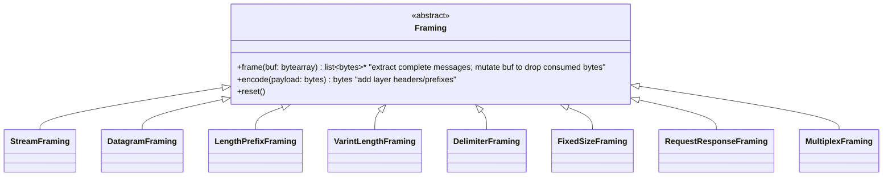
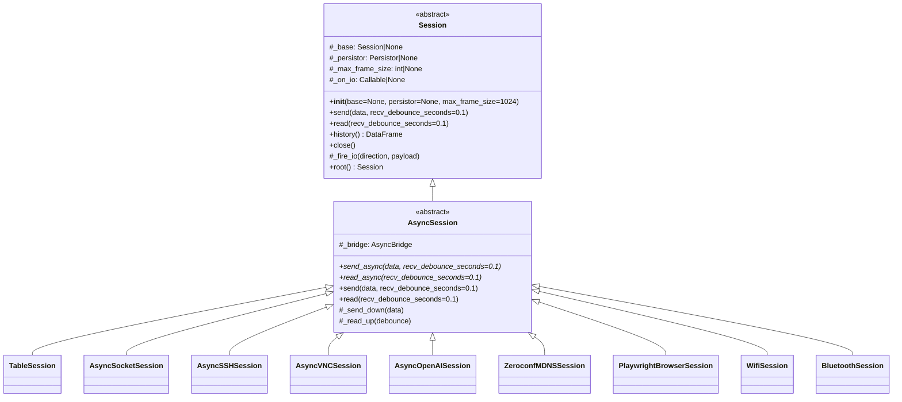
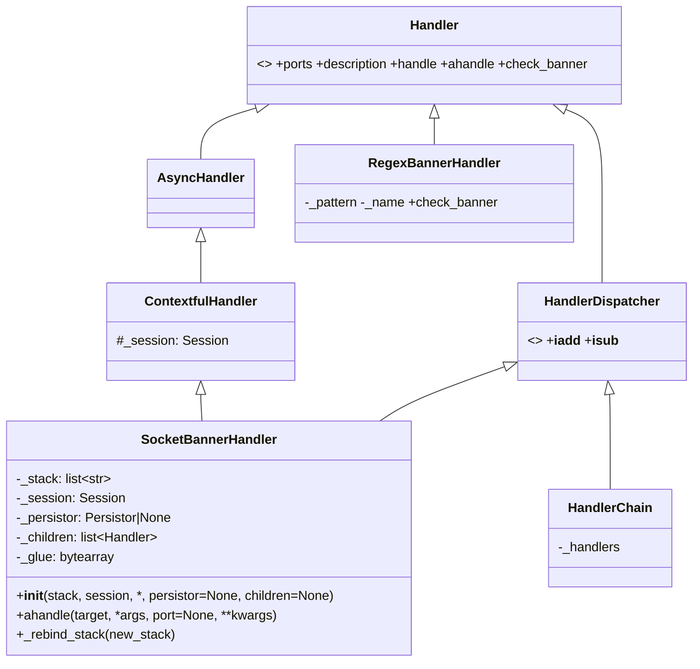
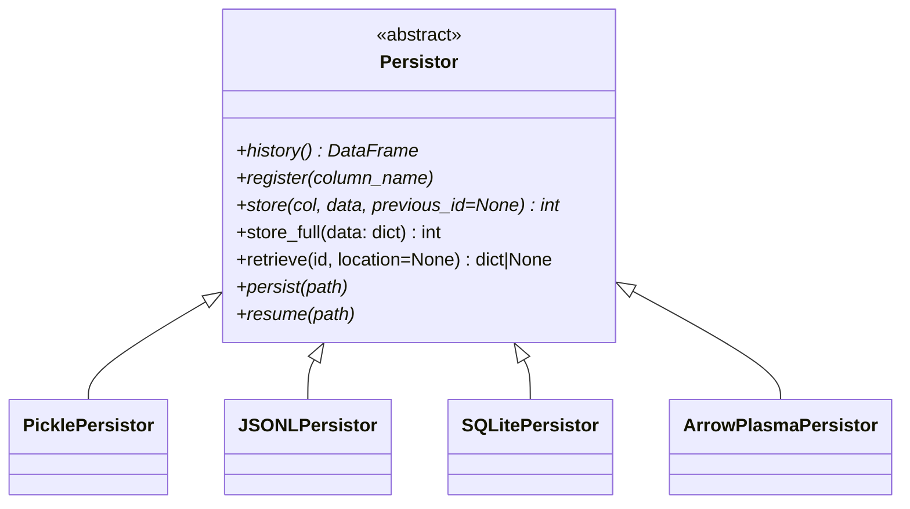
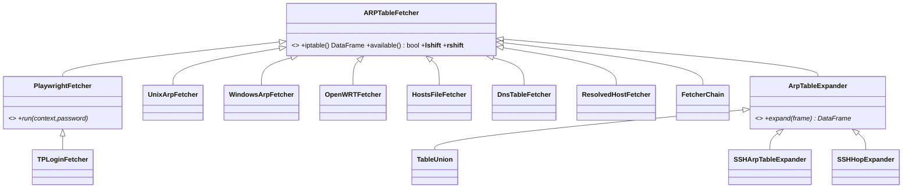
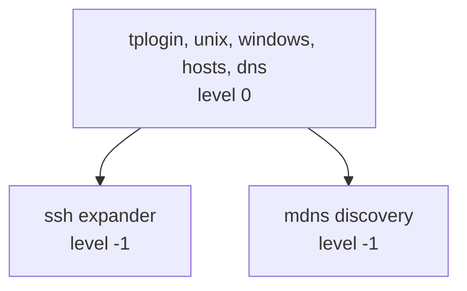
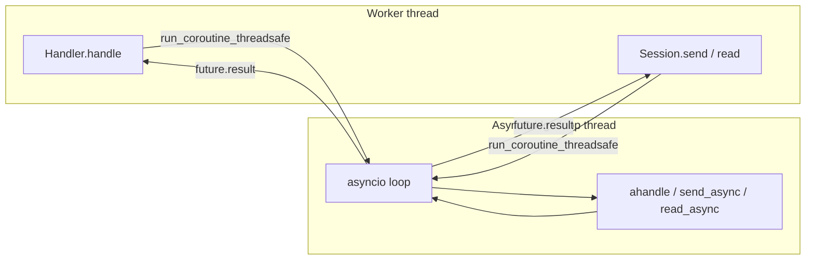
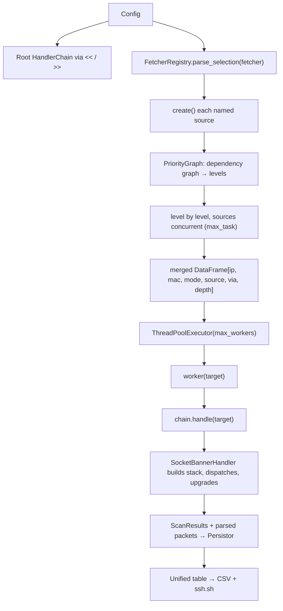
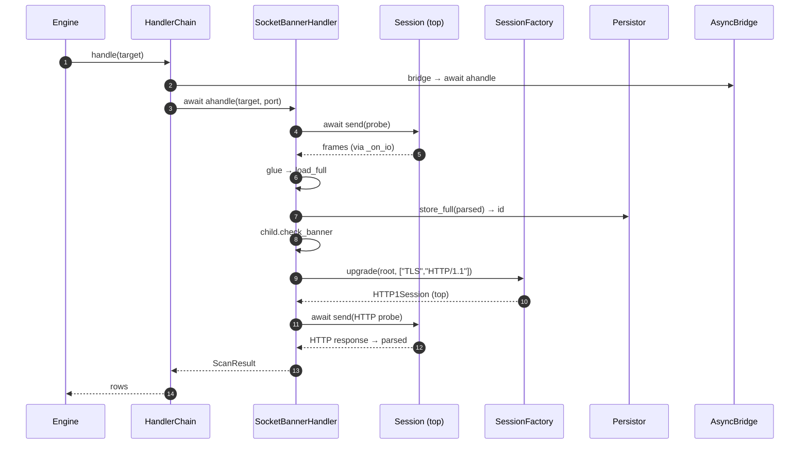

# Final Design v4 — Data-Driven Layers

Two changes: (6) `TableSession` + `Framing` strategies replace ~70 hand-written classes, and (8) `SocketBannerHandler` takes **both a stack spec and a live session**.

---

## 1. Data-Driven Layer Model

### 1a. The observation

Almost every protocol in the map is one of a handful of **shapes**:

| Shape | Examples | What it does |
|---|---|---|
| **Stream passthrough** | raw TCP, UDP, TLS post-handshake | bytes in = bytes out |
| **Length-prefixed framing** | TLS records, SSH packets, WebSocket, MQTT | 2/4/varint length header |
| **Delimiter framing** | HTTP/1.1, IRC, SMTP, NNTP | `\r\n` or `\r\n\r\n` terminator |
| **Fixed-size records** | RTP, some crypto primitives | N-byte frames |
| **Request/response** | HTTP/1.1 | request → response pairing |
| **Multiplexed streams** | HTTP/2, HTTP/3, QUIC | stream IDs + length headers |
| **Auth wrapper** | SASL, GSSAPI, Kerberos, RADIUS | handshake then passthrough |
| **Tunnel establishment** | SOCKS, HTTP CONNECT, STUN, TURN | negotiate then passthrough |
| **Encryption transform** | TLS, DTLS, WireGuard, SSH transport | byte-level encrypt/decrypt |

Instead of ~70 subclasses, we describe each layer as **data** (`LayerSpec`) + **one of a few strategies** (`Framing`, `Transform`).

### 1b. Framing strategies



```python
class Framing(ABC):
    @abstractmethod
    def frame(self, buf: bytearray) -> list[bytes]: ...
    def encode(self, payload: bytes) -> bytes: return payload
    def reset(self): pass


class StreamFraming(Framing):
    """No framing — pass bytes up to max_frame_size as-is."""
    def frame(self, buf):
        if not buf: return []
        out = [bytes(buf)]; buf.clear(); return out


class DatagramFraming(StreamFraming): pass  # UDP: one datagram = one frame


class LengthPrefixFraming(Framing):
    def __init__(self, prefix_bytes, *, big_endian=True, header_bytes=0,
                 max_frame=1 << 24):
        self._pb, self._be, self._hb, self._max = \
            prefix_bytes, big_endian, header_bytes, max_frame

    def frame(self, buf):
        out = []
        while len(buf) >= self._pb:
            n = int.from_bytes(buf[:self._pb],
                               "big" if self._be else "little")
            if n > self._max: raise ValueError(f"oversize frame: {n}")
            total = self._pb + n
            if len(buf) < total: break
            out.append(bytes(buf[self._pb:total]))
            del buf[:total]
        return out

    def encode(self, payload):
        return len(payload).to_bytes(self._pb, "big" if self._be else "little") \
               + payload


class VarintLengthFraming(Framing):
    """MQTT / QUIC / WebSocket-style variable-length integer prefix."""
    # ... 1..4 byte varint encoding


class DelimiterFraming(Framing):
    def __init__(self, sep=b"\r\n", *, include_sep=False):
        self._sep, self._inc = sep, include_sep

    def frame(self, buf):
        out = []
        while True:
            i = buf.find(self._sep)
            if i < 0: break
            end = i + len(self._sep)
            out.append(bytes(buf[:end if self._inc else i]))
            del buf[:end]
        return out

    def encode(self, payload):
        return payload + self._sep


class FixedSizeFraming(Framing):
    def __init__(self, size): self._size = size
    def frame(self, buf):
        out = []
        while len(buf) >= self._size:
            out.append(bytes(buf[:self._size]))
            del buf[:self._size]
        return out


class RequestResponseFraming(Framing):
    """HTTP/1.1: split on \r\n\r\n, then body by Content-Length / chunked."""
    # ... state machine over buf


class MultiplexFraming(Framing):
    """HTTP/2 / HTTP/3 / QUIC: extract frames with stream_id + length."""
    # ... per-stream reassembly buffers
```

Every strategy exposes the same two calls. Layers that need to interleave framing + transform just compose them.

### 1c. LayerSpec — the data table

```python
@dataclass(frozen=True)
class LayerSpec:
    name: str
    framing: Framing = field(default_factory=StreamFraming)
    transform_out: Callable[[bytes], bytes] | None = None
    transform_in:  Callable[[bytes], bytes] | None = None
    handshake_out: bytes | Callable[[], bytes] | None = None
    override_class: type["AsyncSession"] | None = None
    allowed_bases: tuple[str, ...] | None = None      # doc / validation
    ports_hint:    tuple[int, ...] = ()
    description:   str = ""
    requires:      tuple[str, ...] = ()               # auth deps (SASL, GSSAPI, …)
```

| Field | Meaning |
|---|---|
| `framing` | how this layer slices a byte stream into messages |
| `transform_out` / `transform_in` | byte-level encrypt/decrypt (TLS, WireGuard, SRTP, …) |
| `handshake_out` | bytes to send once on open (e.g. ClientHello, `EHLO`) |
| `override_class` | escape hatch — use a hand-written class instead of `TableSession` |
| `allowed_bases` | for documentation and optional runtime validation |
| `ports_hint` | suggested ports |
| `requires` | auth shims this layer typically sits above |

The **dependency edges** from the mermaid map are not stored in the spec — they're enforced at *build time* by the stack you pass to `SessionFactory`. Same protocol can sit over TCP or UDP (e.g. OpenVPN); the stack decides.

### 1d. Registry = one dict

```python
LAYERS: dict[str, LayerSpec] = {
    # --- roots -------------------------------------------------------
    "TCP":   LayerSpec("TCP", StreamFraming(), ports_hint=(80, 443, 22, 25, 587, 3306, 5432, 6379, 8080, 8443), description="TCP stream"),
    "UDP":   LayerSpec("UDP", DatagramFraming(), ports_hint=(53, 123, 161, 5353), description="UDP datagrams"),

    # --- security / encryption shims ---------------------------------
    "TLS":   LayerSpec("TLS", LengthPrefixFraming(2, header_bytes=5),
                       transform_out=tls_encrypt, transform_in=tls_decrypt,
                       allowed_bases=("TCP",), ports_hint=(443, 465, 636, 853, 993, 995),
                       description="TLS / SSL over TCP"),
    "DTLS":  LayerSpec("DTLS", DatagramFraming(),
                       transform_out=dtls_encrypt, transform_in=dtls_decrypt,
                       allowed_bases=("UDP",), description="DTLS over UDP"),
    "SSH":   LayerSpec("SSH", LengthPrefixFraming(4, header_bytes=5),
                       allowed_bases=("TCP",), ports_hint=(22, 2222, 8022),
                       description="SSH transport"),
    "IPsec": LayerSpec("IPsec", DatagramFraming(), allowed_bases=("UDP",), ports_hint=(500, 4500)),
    "WireGuard": LayerSpec("WireGuard", DatagramFraming(), allowed_bases=("UDP",), ports_hint=(51820,)),
    "OpenVPN":   LayerSpec("OpenVPN", LengthPrefixFraming(2),
                           allowed_bases=("TCP", "UDP"), ports_hint=(1194,)),
    "SRTP":  LayerSpec("SRTP", FixedSizeFraming(12), transform_out=srtp_encrypt,
                       transform_in=srtp_decrypt, allowed_bases=("RTP", "DTLS")),
    "ZRTP":  LayerSpec("ZRTP", StreamFraming(), allowed_bases=("RTP",)),

    # --- multiplex / framing -----------------------------------------
    "QUIC":     LayerSpec("QUIC", MultiplexFraming(), allowed_bases=("UDP",), ports_hint=(443, 80),
                          description="QUIC transport"),
    "HTTP/1.1": LayerSpec("HTTP/1.1", RequestResponseFraming(),
                          allowed_bases=("TCP", "TLS"), ports_hint=(80, 8080, 8000, 8888, 6099, 3080, 30000, 2358, 11434),
                          description="HTTP/1.1"),
    "HTTP/2":   LayerSpec("HTTP/2", MultiplexFraming(), handshake_out=H2_PREFACE,
                          allowed_bases=("TCP", "TLS"), ports_hint=(443, 8443),
                          description="HTTP/2 with HPACK"),
    "HTTP/3":   LayerSpec("HTTP/3", MultiplexFraming(), allowed_bases=("QUIC",)),
    "WebSocket": LayerSpec("WebSocket", LengthPrefixFraming(2, header_bytes=2),
                           handshake_out=ws_upgrade, allowed_bases=("TCP", "TLS", "HTTP/1.1", "HTTP/2")),

    # --- auth / AAA ---------------------------------------------------
    "SASL":     LayerSpec("SASL", StreamFraming(), allowed_bases=("TCP",)),
    "GSSAPI":   LayerSpec("GSSAPI", StreamFraming(), allowed_bases=("SASL", "Kerb")),
    "Kerberos": LayerSpec("Kerberos", LengthPrefixFraming(4), allowed_bases=("TCP", "UDP"), ports_hint=(88,)),
    "RADIUS":   LayerSpec("RADIUS", LengthPrefixFraming(2), allowed_bases=("UDP", "TLS"), ports_hint=(1812, 1813)),
    "EAP":      LayerSpec("EAP", LengthPrefixFraming(2), allowed_bases=("RADIUS",)),
    "TACACS+":  LayerSpec("TACACS+", LengthPrefixFraming(4), allowed_bases=("TCP",), ports_hint=(49,)),
    "Diameter": LayerSpec("Diameter", LengthPrefixFraming(3), allowed_bases=("TCP", "TLS"), ports_hint=(3868,)),

    # --- tunnel / proxy ----------------------------------------------
    "SOCKS":        LayerSpec("SOCKS", StreamFraming(), allowed_bases=("TCP", "UDP"), ports_hint=(1080,)),
    "HTTP CONNECT": LayerSpec("HTTP CONNECT", StreamFraming(), allowed_bases=("HTTP/1.1",)),
    "STUN":         LayerSpec("STUN", LengthPrefixFraming(2), allowed_bases=("UDP", "TCP"), ports_hint=(3478,)),
    "TURN":         LayerSpec("TURN", LengthPrefixFraming(2), allowed_bases=("UDP", "TCP", "TLS"), ports_hint=(3478, 5349)),
    "ICE":          LayerSpec("ICE", StreamFraming(), allowed_bases=("STUN", "TURN")),
    "L2TP":         LayerSpec("L2TP", LengthPrefixFraming(2), allowed_bases=("UDP",), ports_hint=(1701,)),
    "VXLAN":        LayerSpec("VXLAN", DatagramFraming(), allowed_bases=("UDP",), ports_hint=(4789,)),
    "Geneve":       LayerSpec("Geneve", DatagramFraming(), allowed_bases=("UDP",), ports_hint=(6081,)),
    "SSTP":         LayerSpec("SSTP", LengthPrefixFraming(2), allowed_bases=("TLS",), ports_hint=(443,)),

    # --- RPC / messaging ---------------------------------------------
    "ONC RPC":  LayerSpec("ONC RPC", LengthPrefixFraming(4, header_bytes=4, big_endian=True),
                          allowed_bases=("TCP", "UDP"), ports_hint=(111, 2049)),
    "DCE RPC":  LayerSpec("DCE RPC", LengthPrefixFraming(2), allowed_bases=("TCP", "UDP"), ports_hint=(135,)),
    "gRPC":     LayerSpec("gRPC", LengthPrefixFraming(4), allowed_bases=("HTTP/2", "TLS"), ports_hint=(50051,)),
    "Thrift":   LayerSpec("Thrift", LengthPrefixFraming(4), allowed_bases=("TCP", "TLS"), ports_hint=(9090,)),
    "JSON-RPC": LayerSpec("JSON-RPC", RequestResponseFraming(), allowed_bases=("HTTP/1.1",)),
    "XML-RPC":  LayerSpec("XML-RPC", RequestResponseFraming(), allowed_bases=("HTTP/1.1",)),
    "MQTT":     LayerSpec("MQTT", VarintLengthFraming(), allowed_bases=("TCP", "TLS", "WS"), ports_hint=(1883, 8883)),
    "AMQP":     LayerSpec("AMQP", LengthPrefixFraming(4), allowed_bases=("TCP", "TLS"), ports_hint=(5672, 5671)),
    "STOMP":    LayerSpec("STOMP", DelimiterFraming(b"\x00"), allowed_bases=("TCP", "WS"), ports_hint=(61613,)),
    "XMPP":     LayerSpec("XMPP", DelimiterFraming(b"</stream:stream>", include_sep=True),
                          allowed_bases=("TCP", "TLS"), ports_hint=(5222, 5223)),
    "IRC":      LayerSpec("IRC", DelimiterFraming(b"\r\n"), allowed_bases=("TCP", "TLS"), ports_hint=(6667, 6697)),
    "Kafka":    LayerSpec("Kafka", LengthPrefixFraming(4), allowed_bases=("TCP", "TLS"), ports_hint=(9092, 9093)),

    # --- media / real-time -------------------------------------------
    "RTP":     LayerSpec("RTP", FixedSizeFraming(12), allowed_bases=("UDP",)),
    "RTCP":    LayerSpec("RTCP", LengthPrefixFraming(2, header_bytes=2), allowed_bases=("UDP",)),
    "RTSP":    LayerSpec("RTSP", DelimiterFraming(b"\r\n\r\n"), allowed_bases=("TCP", "UDP"), ports_hint=(554, 8554)),
    "SIP":     LayerSpec("SIP", DelimiterFraming(b"\r\n\r\n"), allowed_bases=("UDP", "TCP", "TLS"), ports_hint=(5060, 5061)),
    "H.323":   LayerSpec("H.323", LengthPrefixFraming(2), allowed_bases=("TCP", "UDP"), ports_hint=(1720,)),
    "WebRTC":  LayerSpec("WebRTC", StreamFraming(), allowed_bases=("DTLS", "SRTP", "ICE", "SIP", "H.323")),

    # --- applications --------------------------------------------------
    "DNS":     LayerSpec("DNS", LengthPrefixFraming(2), allowed_bases=("UDP", "TCP", "TLS", "HTTP/1.1", "HTTP/2", "QUIC"),
                         ports_hint=(53, 853, 5353)),
    "DHCP":    LayerSpec("DHCP", DatagramFraming(), allowed_bases=("UDP",), ports_hint=(67, 68)),
    "NTP":     LayerSpec("NTP", FixedSizeFraming(48), allowed_bases=("UDP", "TLS"), ports_hint=(123,)),
    "SNMP":    LayerSpec("SNMP", LengthPrefixFraming(2), allowed_bases=("UDP", "TCP"), ports_hint=(161, 162)),
    "Syslog":  LayerSpec("Syslog", DelimiterFraming(b"\n"), allowed_bases=("UDP", "TCP", "TLS"), ports_hint=(514, 6514)),
    "NetFlow": LayerSpec("NetFlow", LengthPrefixFraming(2), allowed_bases=("UDP",), ports_hint=(2055,)),
    "BGP":     LayerSpec("BGP", LengthPrefixFraming(2, header_bytes=19), allowed_bases=("TCP",), ports_hint=(179,)),
    "RIP":     LayerSpec("RIP", DatagramFraming(), allowed_bases=("UDP",), ports_hint=(520,)),
    "LDAP":    LayerSpec("LDAP", LengthPrefixFraming(2), allowed_bases=("TCP", "TLS", "SASL", "GSSAPI"), ports_hint=(389, 636)),
    "SMTP":    LayerSpec("SMTP", DelimiterFraming(b"\r\n"), allowed_bases=("TCP", "TLS", "SASL"), ports_hint=(25, 465, 587)),
    "IMAP":    LayerSpec("IMAP", DelimiterFraming(b"\r\n"), allowed_bases=("TCP", "TLS", "SASL"), ports_hint=(143, 993)),
    "POP3":    LayerSpec("POP3", DelimiterFraming(b"\r\n"), allowed_bases=("TCP", "TLS", "SASL"), ports_hint=(110, 995)),
    "FTP":     LayerSpec("FTP", DelimiterFraming(b"\r\n"), allowed_bases=("TCP", "TLS"), ports_hint=(21,)),
    "SFTP":    LayerSpec("SFTP", LengthPrefixFraming(4), allowed_bases=("SSH",)),
    "SCP":     LayerSpec("SCP", DelimiterFraming(b"\n"), allowed_bases=("SSH",)),
    "SMB":     LayerSpec("SMB", LengthPrefixFraming(4), allowed_bases=("TCP",), ports_hint=(445, 139)),
    "NFS":     LayerSpec("NFS", LengthPrefixFraming(4), allowed_bases=("ONC RPC", "TCP", "UDP"), ports_hint=(2049,)),
    "WebDAV":  LayerSpec("WebDAV", RequestResponseFraming(), allowed_bases=("HTTP/1.1", "TLS")),
    "WSS":     LayerSpec("WSS", LengthPrefixFraming(2, header_bytes=2), allowed_bases=("WS", "TLS")),
    "DB":      LayerSpec("DB", LengthPrefixFraming(3), allowed_bases=("TCP", "TLS"),
                         ports_hint=(3306, 5432, 6379, 27017, 1433, 1521)),
    "RDP":     LayerSpec("RDP", LengthPrefixFraming(2), allowed_bases=("TCP", "TLS"), ports_hint=(3389,)),
    "VNC":     LayerSpec("VNC", LengthPrefixFraming(4, header_bytes=8), allowed_bases=("TCP", "TLS"), ports_hint=(5900, 5901, 5800)),
    "Telnet":  LayerSpec("Telnet", DelimiterFraming(b"\r\n"), allowed_bases=("TCP",), ports_hint=(23,)),
    "WHOIS":   LayerSpec("WHOIS", DelimiterFraming(b"\n"), allowed_bases=("TCP",), ports_hint=(43,)),
    "NNTP":    LayerSpec("NNTP", DelimiterFraming(b"\r\n"), allowed_bases=("TCP",), ports_hint=(119, 563)),
    "CoAP":    LayerSpec("CoAP", LengthPrefixFraming(2, header_bytes=4), allowed_bases=("UDP", "DTLS"), ports_hint=(5683, 5684)),
    "SSDP":    LayerSpec("SSDP", DelimiterFraming(b"\r\n\r\n"), allowed_bases=("UDP",), ports_hint=(1900,)),
    "mDNS":    LayerSpec("mDNS", LengthPrefixFraming(2), allowed_bases=("UDP",), ports_hint=(5353,)),
    "LLMNR":   LayerSpec("LLMNR", LengthPrefixFraming(2), allowed_bases=("UDP",), ports_hint=(5355,)),
    "TFTP":    LayerSpec("TFTP", LengthPrefixFraming(2, header_bytes=2), allowed_bases=("UDP",), ports_hint=(69,)),
}
```

Each entry is exactly one line. **~70 protocols, ~70 lines of data.**

### 1e. `TableSession` — the single concrete class

```python
class TableSession(AsyncSession):
    """A session whose behavior is entirely determined by its LayerSpec."""

    def __init__(self, spec: LayerSpec, *, base, persistor=None,
                 max_frame_size=1024, **root_kwargs):
        super().__init__(base=base, persistor=persistor,
                         max_frame_size=max_frame_size, **root_kwargs)
        self.spec = spec
        self._inbuf = bytearray()
        self._handshake_sent = False

    async def _ensure_open(self):
        if not self._handshake_sent and self.spec.handshake_out is not None:
            hs = (self.spec.handshake_out() if callable(self.spec.handshake_out)
                  else self.spec.handshake_out)
            await self._send_down(hs)
            self._handshake_sent = True

    async def send_async(self, data, recv_debounce_seconds=0.1):
        await self._ensure_open()
        wire = data
        if self.spec.transform_out is not None:
            wire = self.spec.transform_out(wire)
        wire = self.spec.framing.encode(wire)
        await self._send_down(wire)

    async def read_async(self, recv_debounce_seconds=0.1):
        raw = await self._read_up(recv_debounce_seconds)
        if raw is None:
            return None
        self._inbuf.extend(raw)
        frames = self.spec.framing.frame(self._inbuf)
        if not frames:
            return None
        if self.spec.transform_in is not None:
            frames = [self.spec.transform_in(f) for f in frames]
        return frames

    def close(self):
        if self._base is not None:
            self._base.close()
```

Every protocol's behavior flows from `LayerSpec.framing` + `transform_out/in` + `handshake_out`.

### 1f. Escape hatch — `override_class`

Some layers can't be expressed as pure data (they need a library, state machine, or asynchronous negotiation):

| Layer | Why | override_class |
|---|---|---|
| Playwright | browser automation, not byte framing | `PlaywrightBrowserSession` |
| SSH (full) | `asyncssh` handles KEX + channels | `AsyncSSHSession` |
| VNC (full) | `asyncvnc` handles RFB state machine | `AsyncVNCSession` |
| OpenAI | uses `openai.AsyncOpenAI` SDK, not raw HTTP | `AsyncOpenAISession` |
| DNS-over-HTTPS | `httpx` + JSON encoding | `AsyncDoHSession` |
| mDNS | `zeroconf` handles multicast + records | `ZeroconfMDNSSession` |
| `*SocketSession` | raw socket convenience | `AsyncSocketSession` |

So:

```python
LAYERS["SSH"].override_class = AsyncSSHSession
LAYERS["VNC"].override_class = AsyncVNCSession
LAYERS["mDNS"].override_class = ZeroconfMDNSSession
LAYERS["Playwright"].override_class = PlaywrightBrowserSession
```

When `SessionFactory` sees `override_class`, it instantiates that class (passing the spec). The override class **is still a `Session`** and gets `_base`, `_persistor`, `_on_io` the same way.

```python
class AsyncSSHSession(AsyncSession):
    """Escape-hatch: wraps asyncssh; spec is metadata only."""
    spec = LAYERS["SSH"]

    async def send_async(self, data, recv_debounce_seconds=0.1):
        self._conn = self._conn or await asyncssh.connect(self._host, self._port)
        self._writer.write(data); await self._writer.drain()

    async def read_async(self, recv_debounce_seconds=0.1):
        return await asyncio.wait_for(self._reader.read(65536),
                                      timeout=recv_debounce_seconds)
```

**Result:** 8 hand-written classes for the layers that genuinely need code, 1 `TableSession` for the rest, and one big `LAYERS` dict for the metadata.

### 1g. Registry + Factory

```python
class SessionRegistry:
    _specs: dict[str, LayerSpec] = {}

    @classmethod
    def register(cls, spec: LayerSpec): cls._specs[spec.name] = spec

    @classmethod
    def get(cls, name: str) -> LayerSpec:
        if name not in cls._specs:
            raise KeyError(f"unknown layer {name!r}")
        return cls._specs[name]


class SessionFactory:
    @staticmethod
    def build(stack: list[str], *, persistor=None, max_frame_size=1024,
              **root_kwargs) -> AsyncSession:
        if not stack:
            raise ValueError("empty stack")
        root_spec = SessionRegistry.get(stack[0])
        root = SessionFactory._instantiate(root_spec, base=None, **root_kwargs)
        return SessionFactory.upgrade(root, stack[1:],
                                      persistor=persistor,
                                      max_frame_size=max_frame_size)

    @staticmethod
    def upgrade(base: Session, extra: list[str], *,
                persistor=None, max_frame_size=1024) -> AsyncSession:
        top: Session = base
        for i, name in enumerate(extra):
            spec = SessionRegistry.get(name)
            is_top = (i == len(extra) - 1)
            top = SessionFactory._instantiate(
                spec, base=top,
                persistor=persistor if is_top else None,
                max_frame_size=max_frame_size if is_top else None,
            )
        if not extra:                    # upgrade([]) attaches persistor to base
            base._persistor = persistor
            base._max_frame_size = max_frame_size
        return top

    @staticmethod
    def _instantiate(spec: LayerSpec, *, base, **kwargs) -> AsyncSession:
        if spec.override_class is not None:
            return spec.override_class(spec=spec, base=base, **kwargs)
        return TableSession(spec=spec, base=base, **kwargs)
```

---

## 2. `Session` / `AsyncSession` — Same as Before



New addition: `Session.root()` returns the bottom-most session (the one with `base is None`) so `SessionFactory.upgrade` can reuse the live socket.

```python
def root(self) -> "Session":
    s = self
    while s._base is not None:
        s = s._base
    return s
```

---

## 3. `SocketBannerHandler` — Takes Stack **and** Live Session



```python
class SocketBannerHandler(ContextfulHandler, HandlerDispatcher):

    def __init__(self, stack: list[str], session: Session, *,
                 persistor: Persistor | None = None,
                 max_frame_size: int = 1024,
                 children: list[Handler] | None = None):
        super().__init__(session)
        self._stack = list(stack)
        self._persistor = persistor
        self._max_frame_size = max_frame_size
        # attach persistor / hook to the top of the stack
        self._session._persistor = persistor
        self._session._max_frame_size = max_frame_size
        self._session._on_io = self._on_io
        self._children: list[Handler] = []
        self._glue = bytearray()
        for c in children or ():
            self += c

    # --- Handler ---
    def ports(self): return None
    def description(self): return "→".join(self._stack)
    def check_banner(self, banner: bytes) -> bool: return bool(banner)

    # --- Dispatcher ---
    def __iadd__(self, other: Handler):
        other.check_banner(b"")
        self._children.append(other)
        return self

    def __isub__(self, other: Handler):
        self._children.remove(other)
        return self

    # --- Async execution ---
    async def ahandle(self, target, *args, port=None, **kwargs):
        await self._session.send(self._probe_bytes(port))
        banner = bytes(self._glue)
        for child in self._children:
            if child.check_banner(banner):
                deeper = getattr(child, "REQUIRED_STACK", None)
                if deeper and deeper != self._stack:
                    self._rebind_stack(deeper)
                return await child.ahandle(
                    target, *args, port=port, banner=banner, **kwargs)
        return self.handle_banner(banner)

    # --- Stack rebinding — reuses the live socket -------------------
    def _rebind_stack(self, new_stack: list[str]):
        root = self._session.root()           # live TCP/UDP with open fd
        base_len = self._stack.index(
            type(root).spec.name if hasattr(type(root), "spec") else
            self._stack[0]) + 1
        extra = new_stack[base_len:]
        new_top = SessionFactory.upgrade(
            root, extra,
            persistor=self._persistor,
            max_frame_size=self._max_frame_size,
        )
        new_top._on_io = self._on_io
        self._stack = list(new_stack)
        self._session = new_top

    # --- Persistence hook ---
    def _on_io(self, direction: str, payload: bytes):
        if direction != "recv":
            return
        self._glue.extend(payload)
        parsed = self.load_full(bytes(self._glue))
        if parsed is None:
            return
        if self._persistor is not None:
            self._persistor.store_full(parsed)
```

### The two constructor arguments

| Arg | Meaning |
|---|---|
| `stack` | **desired layer stack**, e.g. `["TCP", "TLS", "HTTP/1.1"]` — the handler will build deeper stacks as needed |
| `session` | a **live, raw opened session** to probe with — e.g. an `AsyncSocketSession` wrapping an already-connected socket |

Typical construction:

```python
sock = AsyncSocketSession(sock=await open_connection(host, port))
handler = SocketBannerHandler(
    stack=["TCP"],
    session=sock,
    persistor=JSONLPersistor("scan.jsonl"),
)
handler += RegexBannerHandler(r"^SSH-", name="SSH",
                              stack=["TCP", "SSH"])
handler += RegexBannerHandler(r"^HTTP/", name="HTTP",
                              stack=["TCP", "HTTP/1.1"])
```

When a child declares a deeper stack, the handler upgrades in-place — reusing the live TCP root.

---

## 4. `RegexBannerHandler` — Unchanged

```python
class RegexBannerHandler(Handler):
    def __init__(self, pattern, name, *, stack: list[str] | None = None):
        self._pattern = re.compile(pattern) if isinstance(pattern, str) else pattern
        self._name = name
        self.REQUIRED_STACK = stack

    def ports(self): return None
    def description(self): return f"regex:{self._pattern.pattern} → {self._name}"

    def check_banner(self, banner: bytes) -> bool:
        try:
            return bool(self._pattern.search(banner.decode("utf-8", "ignore")))
        except Exception:
            return False

    def handle(self, target, *args, port=None, banner=b"", **kwargs):
        return ScanResult(port=port, service=self._name, banner=banner)
```

---

## 5. `HandlerChain` — Mixed Sync/Async

```python
class HandlerChain(HandlerDispatcher):
    def __init__(self, handlers):
        self._handlers = _flatten(handlers)

    def ports(self):
        seen, out = set(), []
        for h in self._handlers:
            p = h.ports()
            if p is None: continue
            for x in p:
                if x not in seen: seen.add(x); out.append(x)
        return out or None

    def description(self):
        return " → ".join(h.description() for h in self._handlers)

    def __iadd__(self, other): self._handlers.append(other); return self
    def __isub__(self, other): self._handlers.remove(other); return self

    async def ahandle(self, target, *args, **kwargs):
        for h in self._handlers:
            r = await h.ahandle(target, *args, **kwargs)
            if r is not None: return r
        return None
```

---

## 6. `Persistor` — Unchanged



`store_full` chains `store` calls via `previous_id` and returns the last id. `retrieve(id, location)` checks cache, auto-`resume`s if needed, returns `None` if missing.

---

## 7. ARP Fetchers, FQDNs and Expanders



### 7a. `FQDN` — one type for everything reachable

"FQDN" is used in its widest sense: **anything the computer can reach**. A
reachable endpoint is an IPv4 address, an IPv6 address, a MAC address, a
resolvable domain name, or a host behind a chain of SSH hops — and the prober
meets all of them in the same tables.

`FQDN` is a `str` subclass that classifies itself (`kind` ∈ `ipv4`, `ipv6`,
`mac`, `hostname`, `unknown`), normalises what it can (MAC separators, IPv6
spelling) and keeps equality working through the normalised value. Existing
callers that pass plain strings keep working unchanged.

| Member | Meaning |
|---|---|
| `kind` / `is_ipv4` … `is_hostname` | which shape of endpoint this is |
| `value` | normalised spelling |
| `hops`, `is_hop_chain`, `origin`, `destination` | `bastion>jump>target` |
| `from_mac(mac, offset)` | derive a stable IPv4 endpoint for a MAC-only host |
| `apply_offset(n)` | move an IPv4/IPv6 endpoint (raises for MAC/name) |

`from_mac` is the primitive that makes expansion possible at all: a MAC has no
address arithmetic, so a host known *only* by MAC is derived into the RFC 5737
documentation range (`192.0.2.0/24`) by a pure function of the MAC and the
offset. That determinism is what lets two fetchers — and two runs — agree on
the identity of a host they each discovered a different way.

### 7b. Fetchers vs. expanders

A fetcher answers *"who did I already know about?"*.

An **expander** answers *"who else can I now reach, given that table?"* — and
it only ever adds rows, so the result is strictly a superset of what its
upstreams produced.

```python
class ArpTableExpander(ARPTableFetcher):
    def __init__(self, upstream):        # one fetcher, or a list of them
        self.upstream = _as_fetcher_list(upstream)

    @abstractmethod
    def expand(self, frame: pd.DataFrame) -> pd.DataFrame: ...
```

The base class owns the parts that are easy to get wrong: calling upstreams
safely (one broken source must not lose the others), merging their tables,
deduplicating, and tagging provenance. Subclasses implement one method.

| Expander | Expansion rule |
|---|---|
| `TableUnion` | merge every upstream, add nothing — the degenerate case |
| `SSHArpTableExpander` | read each host's neighbour table over SSH, recursively |
| `SSHHopExpander` | walk an explicit `bastion>jump>target` chain, one fetcher per hop |

### 7c. `SSHArpTableExpander`

A LAN is not flat. The machine running the prober sees its own neighbours; the
router sees every DHCP lease; a server two hops away sees a whole subnet
neither of them can reach. The expander closes that gap:

1. seed from the configured hop (`--ssh-hop` / `SSH_HOP`) and the upstream
   table's hosts;
2. for each host, run the *same* neighbour-table commands the local fetchers
   use (`cat /proc/net/arp`, `ip neigh show`, `arp -an`) and parse the output
   with the *same* parsers;
3. add what it found, and enqueue the newly discovered hosts;
4. stop after `max_depth` tables have been collected.

Two deliberate limits: the walk is **opt-in** (`--expand`, off by default),
because logging into other people's machines is invasive; and it is
**depth-bounded**, because a real LAN contains cycles and two hosts that both
know each other would otherwise recurse forever.

Hashed entries in `known_hosts` (`|1|base64|base64`) are skipped: they are
hashed precisely so that reading them is not possible, and guessing which host
they name is worse than not knowing.

### 7d. Provenance

A merged table from five sources is only useful if a reader can tell where each
row came from, so provenance is part of the row:

| Column | Meaning |
|---|---|
| `source` | which fetcher produced the row |
| `via` | which SSH hop(s) saw it (comma-separated, accumulating) |
| `depth` | how many expansion steps away it was |
| `conflict` | this address was seen with a different MAC — a real conflict |

### 7e. Merge rules

`merge_tables()` identifies a host by `(ip, mac_address)`, and the three cases
are not symmetric:

* **same address, same MAC, or one of them absent** → one host, enriched. The
  router's lease table (hostname + MAC + address) and the local neighbour table
  (address + MAC) describe the same machine; collapsing them is what enriches
  the row instead of duplicating it.
* **same address, different MAC** → two rows, both flagged `conflict`. That is
  a stale lease, a spoofed neighbour, or two interfaces on one box — hiding it
  would hide exactly the thing worth seeing.
* **different address, same MAC** → two rows, which is why a MAC is part of the
  identity at all: one machine, two addresses.

### 7f. The registry

`FetcherRegistry` maps a name to a factory, so the engine can ask for a *set*
of sources and merge them:

```python
registry = default_fetcher_registry()
registry.names()                      # ['dns', 'hosts', 'mdns', 'openwrt', 'resolved', 'ssh', 'tplogin', 'unix', 'windows']
registry.parse_selection("unix,dns")  # ['unix', 'dns']
registry.parse_selection("all")       # every name
registry.parse_selection("auto")      # the non-invasive set (no 'ssh', no 'mdns')
```

The registry is also the seam that keeps optional dependencies optional: a
source whose library is missing reports itself `available() == False` rather
than failing the run.

### 7g. Scheduling — why the chain is gone

A fetcher is not something to walk a list of. It declares **when** it may run:

```python
class ARPTableFetcher(ABC):
    priority: int = 0                      # a writable attribute, not a method

    def dependency(self) -> Iterable[Any]: # any iterable; order is ignored
        return ()
```

`priority` is an attribute because the union **rewrites** it: the value after a
run is the level that was actually used. Only the *sign* of the initial value
carries meaning.

`PriorityGraph` solves the declarations into an execution plan:

| Step | Rule |
|---|---|
| level | longest dependency path to a root, negated — so a dependency always holds a larger level than its dependent |
| deferral | a negative initial priority is an implicit dependency on **every** non-negative fetcher |
| collapse | distinct levels squeeze to consecutive integers, which may be negative |
| run | levels from highest to lowest; every fetcher on a level runs concurrently |



Deferral is a single shared shift of the whole negative group, not a per-node
rewrite, so a deferred fetcher that depends on another deferred fetcher still
runs after it. Cycles raise `DependencyCycle` naming the cycle: which edge to
cut is a decision only the caller can make.

`FetcherChain` is **not** in the engine's path. It had two defects a scan cares
about — it discarded every source but the first that answered, and it waited
serially for one source before trying the next. The class remains for a caller
who explicitly wants that, and its docstring says so plainly.

### 7h. Concurrency

Sources are synchronous (Playwright's sync API refuses to run inside a live
event loop), so each level is dispatched from the `AsyncBridge`'s loop into a
thread pool:

```python
limiter = asyncio.Semaphore(self.max_task)

async def guarded(fetcher):
    async with limiter:
        return await asyncio.to_thread(self._fetch_one, fetcher)

results = default_bridge().run(asyncio.gather(*(guarded(f) for f in phase)))
```

`max_task` (`--max-task` / `ARP_MAX_TASK`) bounds how many run at once. One
source failing is logged and skipped; its dependents still run, because a
missing prerequisite degrades a result rather than cancelling work.

### 7i. The `router` extra

`my-lan-prober[router]` declares the three libraries the "get at my router"
story needs, so a user does not have to assemble them:

| capability | library | what it buys |
|---|---|---|
| scrape the UI | `playwright` | the DHCP lease table behind a web login |
| walk over SSH | `asyncssh` | another host's neighbour table, and hops |
| discover locally | `zeroconf` | mDNS names and addresses, with no server |

The individual extras (`playwright`, `ssh`, `mdns`) remain for callers who need
only one. `router.router_capabilities()` reports which are present and imports
none of them at module scope — `import my_lan_prober` must work with no extras
at all, which CI asserts.


---

## 8. `AsyncBridge` — One Loop Per Process



---

## 9. Config + Engine

| CLI | ENV | Default |
|---|---|---|
| `-t/--port-timeout` | `PORT_TIMEOUT` | `0.1` |
| `--workers` | `SCAN_WORKERS` | `os.cpu_count()` |
| `--port-strategy` | `PORT_STRATEGY` | `first` |
| `--resolve-host` | `RESOLVE_HOSTS` | `tplogin.cn,localhost` |
| `--output` | `OUTPUT_CSV` | `tplogin-arp-enriched.csv` |
| `--fetcher` | `ARP_FETCHER` | `tplogin` (a comma-separated set, `all`, or `auto`) |
| `--max-task` | `ARP_MAX_TASK` | `8` (sources in flight per level) |
| `--ssh-hop` | `SSH_HOP` | none |
| `--expand` | `ARP_EXPAND` | off |
| `--expand-depth` | `ARP_EXPAND_DEPTH` | `2` (tables collected) |
| `--unsafe-tplogin-password` | `TPLOGIN_PASSWORD` | prompt |
| `--browser` | `PW_BROWSER` | auto (first installed of chromium/firefox/webkit) |



---

## 10. End-to-End Sequence



---

## 11. Class Inventory (Final)

| Layer | Class | Abstract | Key members |
|---|---|---|---|
| **Framing** | `Framing` | ✔ | `frame(buf)`, `encode(payload)` |
| | `StreamFraming`, `DatagramFraming`, `LengthPrefixFraming`, `VarintLengthFraming`, `DelimiterFraming`, `FixedSizeFraming`, `RequestResponseFraming`, `MultiplexFraming` | ✘ | 7 concrete strategies |
| **Layer spec** | `LayerSpec` | ✘ | `dataclass(frozen)` — name, framing, transforms, handshake, override, ports, deps |
| | `LAYERS: dict[str, LayerSpec]` | ✘ | ~70 entries, one per protocol |
| **Session** | `Session` | ✔ | `_base`, `_persistor`, `_on_io`, `root`, `_fire_io` |
| | `AsyncSession` | ✔ | `send_async*`, `read_async*`, sync wrappers, `_send_down` / `_read_up` |
| | `TableSession` | ✘ | driven entirely by a `LayerSpec` |
| | Escape-hatch classes (`AsyncSocketSession`, `AsyncSSHSession`, `AsyncVNCSession`, `AsyncOpenAISession`, `ZeroconfMDNSSession`, `PlaywrightBrowserSession`, `WifiSession`, `BluetoothSession`) | ✘ | 8 hand-written classes |
| | `SessionRegistry`, `SessionFactory` | ✘ | dict + `build` / `upgrade` |
| **Handler** | `Handler` | ✔ | `REQUIRED_STACK`, `ports*`, `description*`, `handle*`, `ahandle` (default), `check_banner`, `<<`, `>>` |
| | `HandlerDispatcher` | ✔ | `__iadd__*`, `__isub__*` |
| | `AsyncHandler` | ✔ | `ahandle*` + sync `handle` via bridge |
| | `ContextfulHandler` | ✔ | `_session` — kept for WiFi / BT / non-socket targets |
| | `SocketBannerHandler` | ✘ | `(stack, session, *, persistor, children)`; `_rebind_stack` upgrades over live root |
| | `RegexBannerHandler` | ✘ | regex + optional `REQUIRED_STACK` |
| | `HandlerChain` | ✘ | mixed sync / async; `ports()` union |
| **Persistor** | `Persistor` | ✔ | `history*`, `register*`, `store*`, `store_full`, `retrieve`, `persist*`, `resume*` |
| | `PicklePersistor`, `JSONLPersistor`, `SQLitePersistor`, `ArrowPlasmaPersistor` | ✘ | disk-backed |
| **Bridge** | `AsyncBridge` | ✘ | `run(coro)` |
| **Fetcher** | `ARPTableFetcher` | ✔ | `iptable*`, `available`, `dependency`, `priority`, `<<`, `>>` |
| | `PlaywrightFetcher` | ✔ | `run*`, `driver_env`, `browser_engine_name` (was `_detect_latest_browser`) |
| | `TPLoginFetcher`, `UnixArpFetcher`, `WindowsArpFetcher` | ✘ | level 0; the fast local and router reads |
| | `OpenWRTFetcher` | ✘ | level −1; needs credentials, so it goes last |
| | `FetcherChain` | ✘ | legacy serial "first non-empty wins"; **not** the engine's path |
| | `HostsFileFetcher`, `DnsTableFetcher`, `ResolvedHostFetcher` | ✘ | name → address, via `python-hosts` and `dnspython` (A **and** AAAA) |
| | `MdnsFetcher` | ✘ | local discovery; address **and** hostname together; deferred |
| **FQDN** | `FQDN` | ✘ | `str` subclass; `kind`, `hops`, `from_mac`, `apply_offset` |
| **Expander** | `ArpTableExpander` | ✔ | `upstream`, `expand*`, provenance tagging, safe upstream calls |
| | `TableUnion` | ✘ | merge everything, **schedule** it, bound it with `max_task` |
| | `SSHArpTableExpander` | ✘ | known-hosts walk, `asyncssh`, depth-bounded |
| | `SSHHopExpander` | ✘ | explicit `bastion>jump>target` chain |
| **Scheduling** | `PriorityGraph` | ✘ | `levels`, `assign`, `phases`, `plan` |
| | `DependencyCycle` | ✘ | `ValueError` naming the cycle |
| **Registry** | `FetcherRegistry` | ✘ | `register`, `create`, `available`, `parse_selection` |
| **Router** | `router_capabilities`, `missing_capabilities`, `describe` | ✘ | which of Playwright / asyncssh / zeroconf are installed |
| **Browsers** | `detect_browsers`, `first_available_browser` | ✘ | probes `executable_path` per engine |
| **App** | `Config`, `Engine` | ✘ | — |

**Count:** ~70 protocols → **1 `TableSession` + ~8 overrides + 1 `LAYERS` dict**. No subclass explosion.

---

## 12. Final Confirmations

1. **`SocketBannerHandler(stack, session, ...)`** — `session` is a pre-opened `Session` (usually `AsyncSocketSession` over a live socket). The handler attaches `_persistor` / `_on_io` / `_max_frame_size` to the top of that session. Confirm.
2. **`_rebind_stack(new_stack)`** — walks to `session.root()` (live socket), then `SessionFactory.upgrade(root, extra)`. Confirm.
3. **`LAYERS` names match the mermaid map** (e.g. `"HTTP/1.1"`, `"ONC RPC"`, `"TACACS+"`). Confirm — I'll use these exact strings.
4. **`override_class` for `asyncssh`/`asyncvnc`/`openai`/`playwright`/`zeroconf`/raw socket** — 8 hand-written classes; everything else is `TableSession` + `LayerSpec`. Confirm.
5. **`Framing` API**: `frame(buf: bytearray) -> list[bytes]` mutates `buf` in place; `encode(payload) -> bytes` adds headers. Confirm.

Say go and I'll write the implementation.